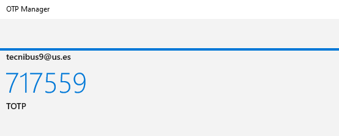

# Instalar el Doble Factor de Autenticación en PC

Este tutorial lo vamos a realizar para el sistema operativo Windows usando una de las aplicaciones recomendadas por el SOS para el PC. Tendremos que realizar los tres pasos en el orden indicado. 

## Paso 1

Nos descargamos [_OPT Manager_](https://apps.microsoft.com/store/detail/otp-manager/9NBLGGH6HNGN?hl=es-es&gl=es) desde **Microsoft Store**.

Le damos a "Obtener en la aplicacion Microsoft Store" y pulsamos en "Abrir Microsoft Store"

## Paso 2

Ahora activamos el servicio en [https://2fa.us.es](https://2fa.us.es)

Primero nos logueamos y le damos a "Activar doble factor". En el primer paso, descargar una aplicacion, le damos a "Hecho"

El paso 2 es el mas importante, le damos a "Mostrar" y seguidamente a "Mostrar los párametros de configuración"

Abrimos la aplicación "OPT Manager" 

Pulsamos en "Agregar manualmente" y nos aparece la siguiente pantella

Ahora vamos añadiendo los parámetros de configuración necesarios para poder activar la doble autenticacion.

En _Etiqueta_ ponemos nuestro correo corporativo.
En _Secreto_ tenemos que pegar la cadena larga de caracteres que nos aparece en la opcion "secreto o clave" en los parámetros de configuración.
En _Editor_ ponemos TOTP y le damos a guardar

En la aplicacion de la universidad le damos a "Hecho" al paso 2 y en el paso 3 nos pide el código que nos aparece en la aplicacion "OTP Manager", lo introducimos y le damos a "Activar".

## Paso 3
**Comprobación de que todo funciona correctamente**

Nos dirigimos a https://vpncubo.us.es y nos pide las credenciales del UVUS y a continuacion el menu de dialogo

Abrimos el OTP Manager y nos aparece una numero de 6 digitos y arriba una barrita azul que va dezplazandose hacia la derecha, aumentando. Esta barrita nos indica el tiempo que tenemos para que el numero de 6 digitos sea válido, la barrita dura 30 segundos por lo que si la vemos muy avanzada, es mejor esperar a que aparezca un nuevo numero.

El numero de 6 digitos que nos facilita OTP Manager es el que tenemos que introducir en el menu de dialogo de https://vpncubo.us.es

