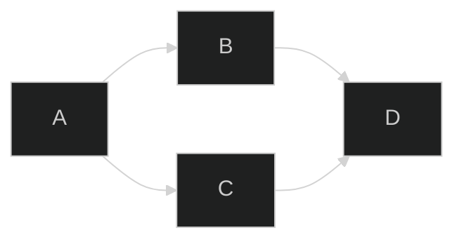
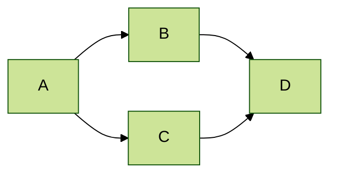
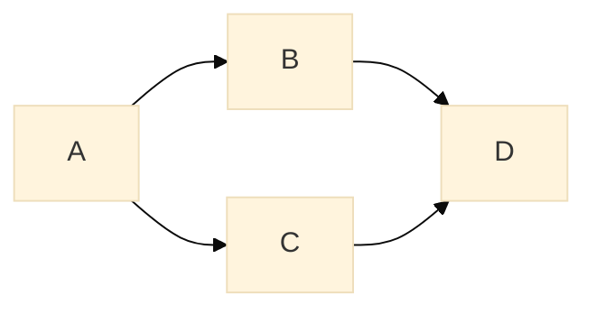
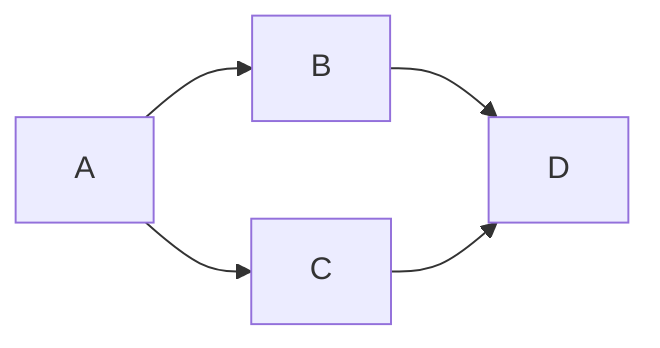
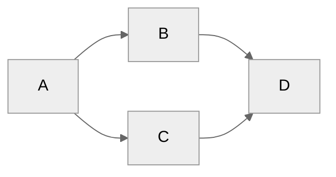
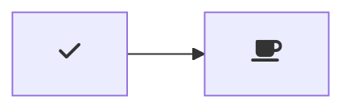
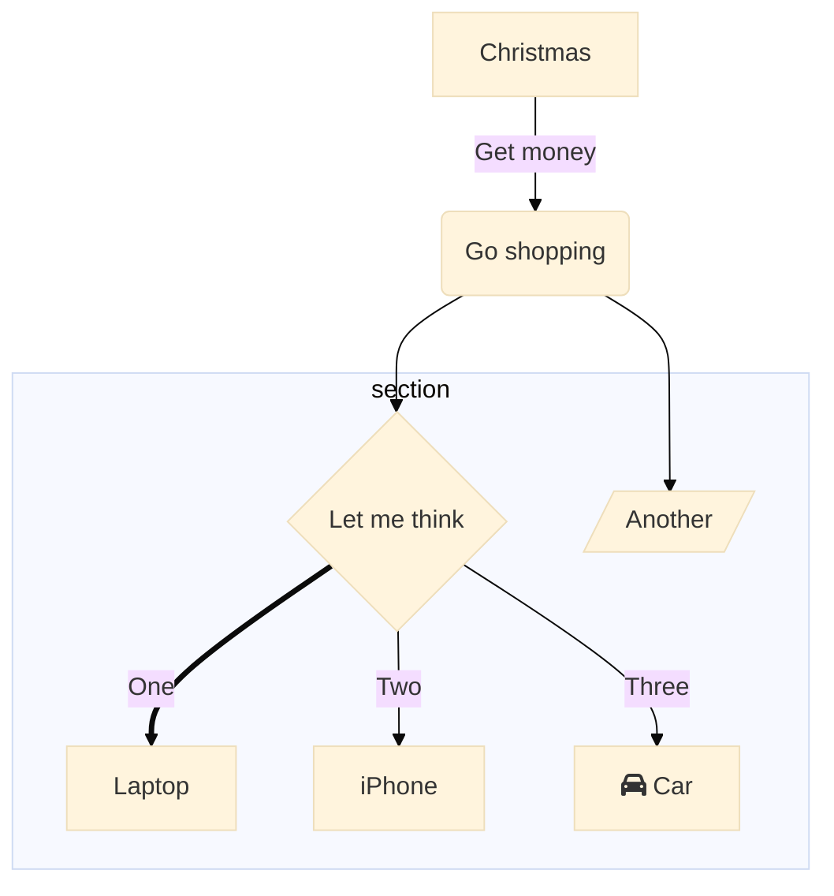

```mermaid
%%{init: {'theme': 'dark', "flowchart" : { "curve" : "basis" } } }%%
graph LR;
    A-->B;
    A-->C;
    B-->D;
    C-->D;
```

```mermaid
%%{init: {'theme': 'forest', "flowchart" : { "curve" : "basis" } } }%%
graph LR;
    A-->B;
    A-->C;
    B-->D;
    C-->D;
```

```mermaid
%%{init: {'theme': 'base', "flowchart" : { "curve" : "basis" } } }%%
graph LR;
    A-->B;
    A-->C;
    B-->D;
    C-->D;
```

```mermaid
%%{init: {'theme': 'default', "flowchart" : { "curve" : "basis" } } }%%
graph LR;
    A-->B;
    A-->C;
    B-->D;
    C-->D;
```

```mermaid
%%{init: {'theme': 'neutral', "flowchart" : { "curve" : "basis" } } }%%
graph LR;
    A-->B;
    A-->C;
    B-->D;
    C-->D;
```

## Otro Ejemplo (colores)

```mermaid
graph LR
    fa:fa-check-->fa:fa-coffee
```

```mermaid
%%{init: {'theme':'base'}}%%
        graph TD
          A[Christmas] -->|Get money| B(Go shopping)
          B --> C{Let me think}
          B --> G[/Another/]
          C ==>|One| D[Laptop]
          C -->|Two| E[iPhone]
          C -->|Three| F[fa:fa-car Car]
          subgraph section
            C
            D
            E
            F
            G
          end
```