# Diagramas generados con mermaid

## Diagrama de clases

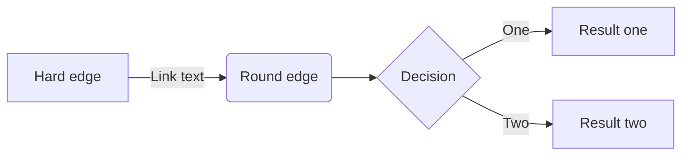

## UML class diagram

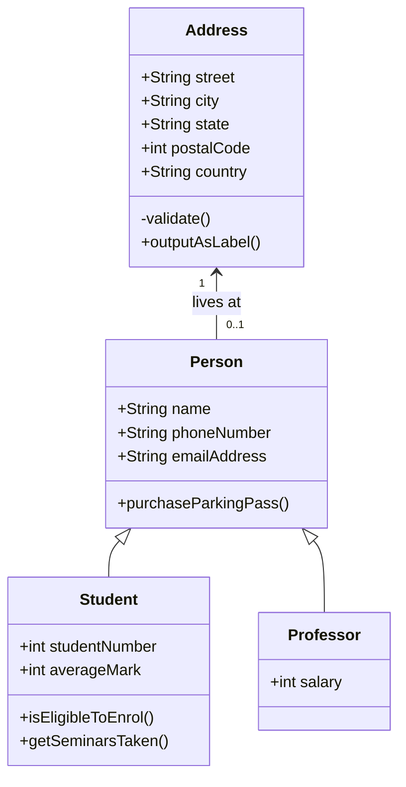

## Diagrama de estados

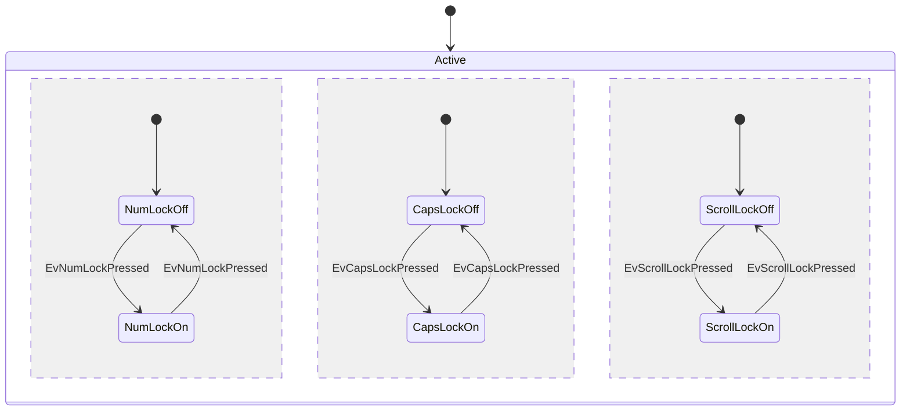

## Diagrama de Entidad Relación

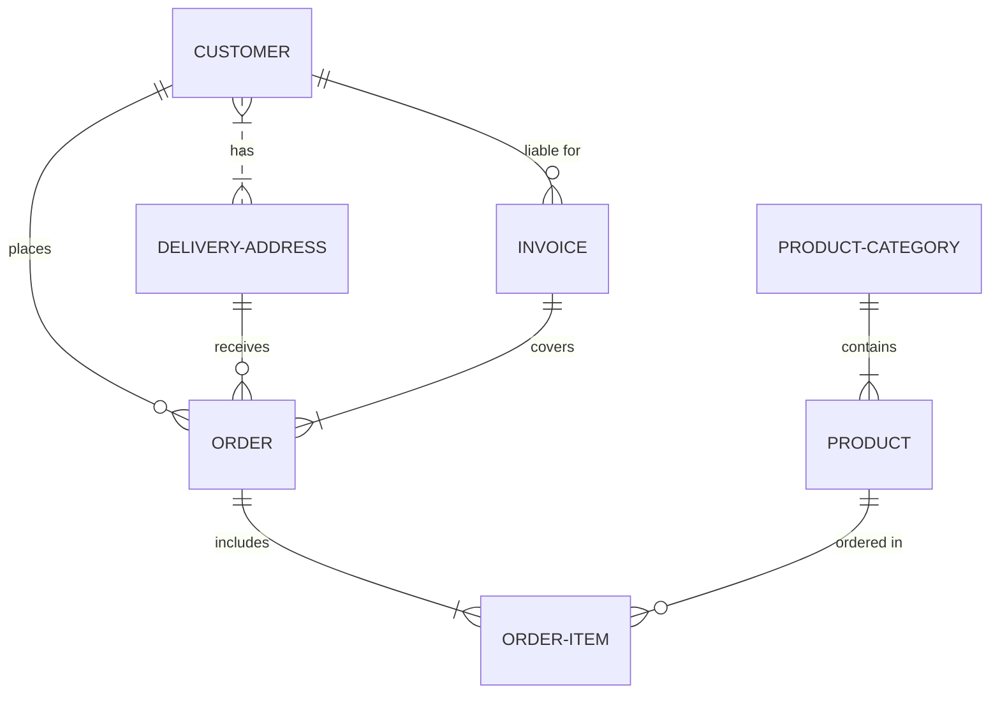

## Diagrama de un viaje

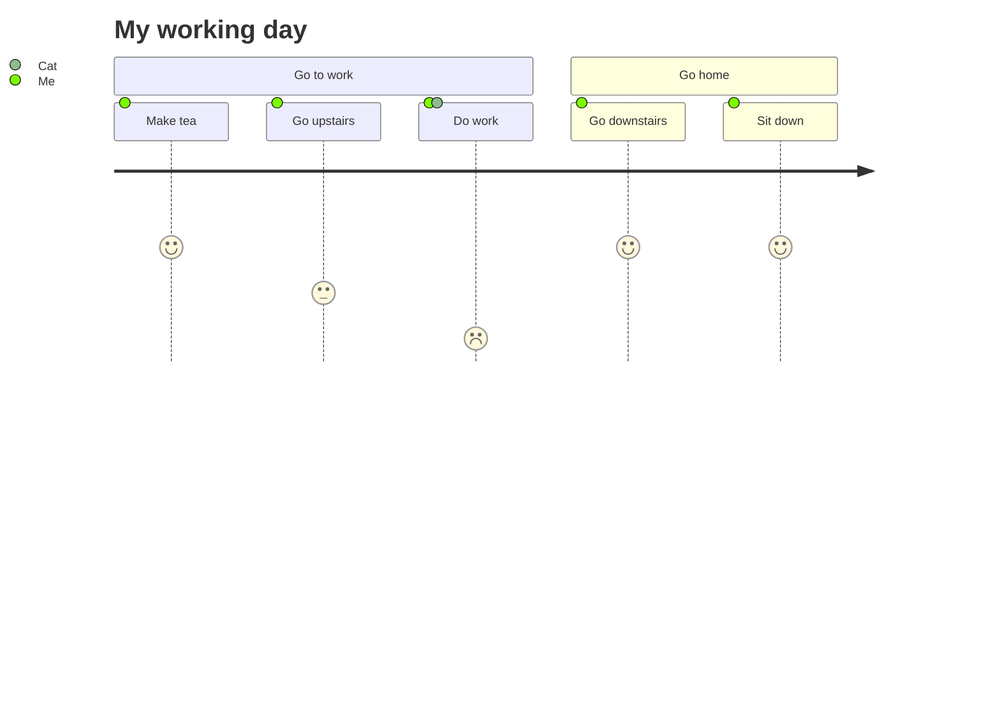

## Diagrama de Gantt

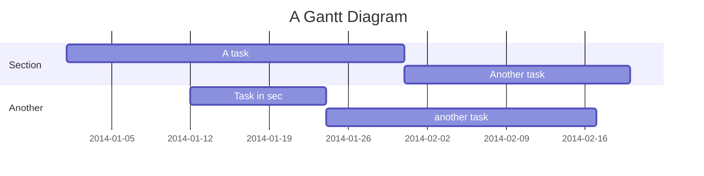
## Tarta

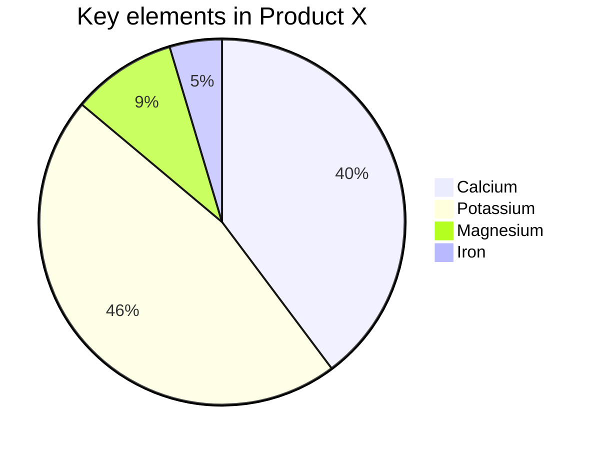

## Diagrama de Requerimientos

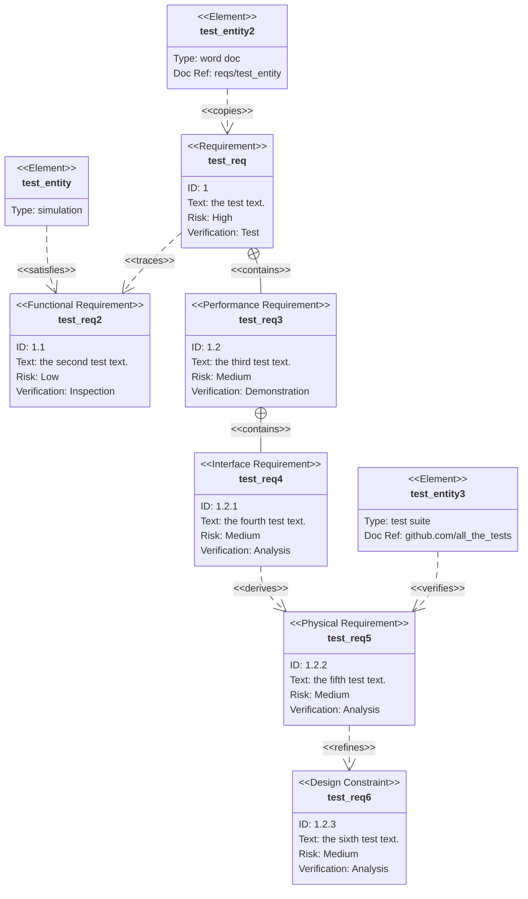

## UML Sequence Diagram

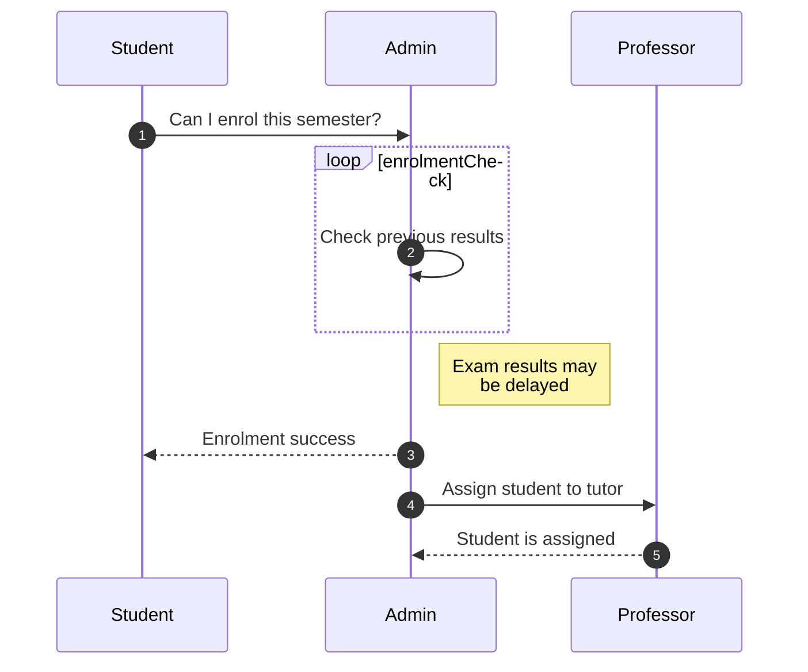

## Diagrama FlowChart

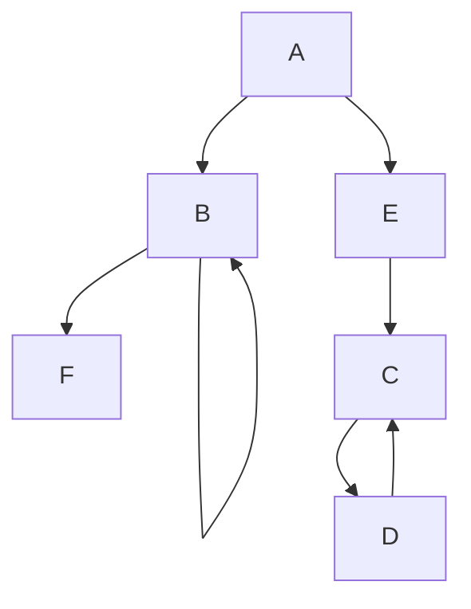
## GitHub HTML Rendering Pipeline

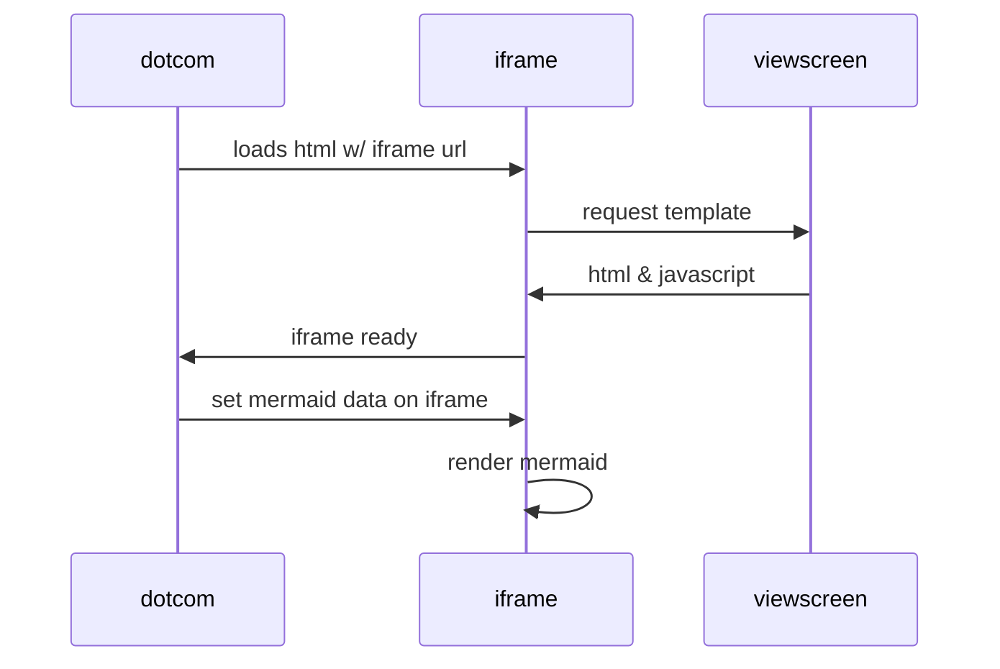

Fuente: https://blog.devgenius.io/diagrams-in-your-github-files-with-mermaid-273003d54421

Fuente: https://mermaid-js.github.io/mermaid/#/README?id=about-mermaid