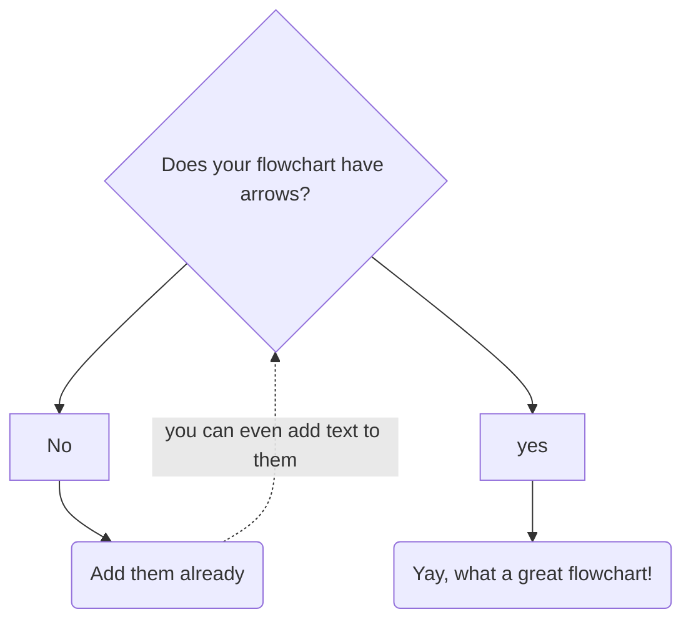

[comment]: <> (https://showdownjs.com/)

# Este documento es una :rat: de 👨‍🔬⚗️🧪
## A Random Sub-Section

# Lorem Ipsum

"Lorem ipsum dolor sit amet, consectetur adipiscing elit, sed do eiusmod tempor incididunt ut labore et dolore magna aliqua. Ut enim ad minim veniam, quis nostrud exercitation ullamco laboris nisi ut aliquip ex ea commodo consequat. Duis aute irure dolor in reprehenderit in voluptate velit esse cillum dolore eu fugiat nulla pariatur. Excepteur sint occaecat cupidatat non proident, sunt in culpa qui officia deserunt mollit anim id est laborum."

#### Lorem ipsum dolor sit amet?
* You can also write an answer in points.
* Cras auctor turpis at erat pellentese dictum.
* Aenean ultricies interdum lorem nec aliam.
+ Ya no se me ocurre nada en Latín
+ Pero este grupo de elementos
+ parece estar separado del otro
- incluso puedo cambiar a otro separador
- y aparece un nuevo grupo

### A Random Sub-Sub-Section
In vitae metus eget velit mollis fermentum. Nunc rutrum pretium am, eu congue nee. Cras consectetur nee ac lacinia porttitor. Etiam ac venenatis velit. In ut enim leo.
#### Donec volutpat vel nisi ac cursus?
You can add a code block in an answer.
```python renderAs=minted
for i in range(3):
	print("===> Outer Loop")
	print(f"i = {i}")
	for j in range(2):
		print("Inner Loop")
		print(f"j = {j}")
```

#### Nunc volutpat massa non ultricies efficitur?
In ut enim leo. Nullam dapibus sapien sapien, iaculis aliam ex lobortis a.

$$
\int_{0}^{\pi} \sin x \, dx = 2
$$

# Another Random Section
#### Suspendisse euismod nulla purus?
You can add a table too.

| Column A | Column B | Column C |
| -------- | -------- | -------- |
| Row 1A   | Row 1B   | Row 1C   |
| Row 2A   | Row 2B   | Row 2C   |


#### Write a Section using H4 header?
