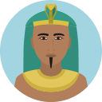

# Ozymandias

I met a traveller from an antique land,  
Who said—“Two vast and trunkless legs of stone  
Stand in the desert. . . . Near them, on the sand,  
Half sunk a shattered visage lies, whose frown,  

And wrinkled lip, and sneer of cold command,  
Tell that its sculptor well those passions read  
Which yet survive, stamped on these lifeless things,  
The hand that mocked them, and the heart that fed;  

And on the pedestal, these words appear:  
My name is Ozymandias, King of Kings;  
Look on my Works, ye Mighty, and despair!  

Nothing beside remains. Round the decay  
Of that colossal Wreck, boundless and bare  
The lone and level sands stretch far away.”  

**_Percey Shelley_**

Fuente: https://www.poetryfoundation.org/poems/46565/ozymandias

Fuente: https://www.poetryfoundation.org/articles/69503/percy-bysshe-shelley-ozymandias

___

# Ozymandias

    Conocí a un viajero de una tierra antigua
    quien dijo: «dos enormes piernas pétreas, sin su tronco
    se yerguen en el desierto. A su lado, en la arena,
    semihundido, yace un rostro hecho pedazos, cuyo ceño

    y mueca en la boca, y desdén de frío dominio,
    cuentan que su escultor comprendió bien esas pasiones
    las cuales aún sobreviven, grabadas en estos inertes objetos,
    a las manos que las tallaron y al corazón que las alimentó.

    Y en el pedestal se leen estas palabras:
    "Mi nombre es Ozymandias, rey de reyes:
    ¡Contemplad mis obras, poderosos, y desesperad!"

    Nada queda a su lado. Alrededor de la decadencia
    de estas colosales ruinas, infinitas y desnudas
    se extienden, a lo lejos, las solitarias y llanas arenas»

